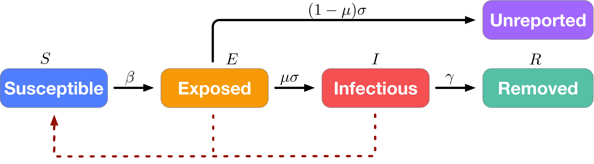
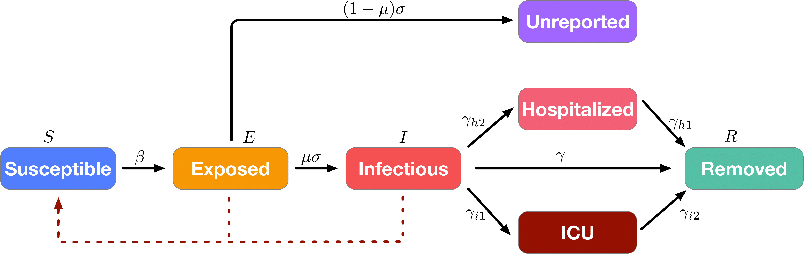

[](https://sonar.sampozki.fi/dashboard?id=projektikurssi)
[](https://sonar.sampozki.fi/dashboard?id=projektikurssi)
[](https://sonar.sampozki.fi/dashboard?id=projektikurssi)
[](https://sonar.sampozki.fi/dashboard?id=projektikurssi)
[](https://sonar.sampozki.fi/dashboard?id=projektikurssi)
[](https://sonar.sampozki.fi/dashboard?id=projektikurssi)
[](https://sonar.sampozki.fi/dashboard?id=projektikurssi)
[](https://sonar.sampozki.fi/dashboard?id=projektikurssi)


# SuEIR model for forecasting the COVID-19 related confirmed cases, deaths, and hospitaliztions.

## What is the SuEIR model?

The SuEIR (see the figure below) model is an epidemic model for forecasting the active cases and deaths of COVID-19 by considering the unreported cases. The critical feature of SuEIR is the new compartment called "Unreported". Specifically,  we  treat  the  "Exposed"  group  in SEIR as the individuals that have already been infected  but  not  been tested,  who  are  also  capable  of infecting  others. Some of the people in the "Exposed" group will be tested and transferred to the "Infectious" group (which  are  reported  to  the  public), while  the  rest  will  recover/die  and  transit  to  the   "Unreported"  group that  are not reported to the public due to testing capacity, asymptomatic infection,  quick recovering, etc.

<p align="center">
    
</p>
<p align="center">
Illustration of the SuEIR model.
</p>


## SuEIR model with hospitalization
In addition to forecasting the numbers of confirmed cases and deaths, the SuEIR++ model incoporates "Hospitalized" and "ICU" compartments into the SuEIR model to enable the forecasting of the hospitalization resources (e.g., hospitalization and ICU beds). The model is illustrated in the figure below.

<p align="center">
    
</p>
<p align="center">
Illustration of the SuEIR++ model.
</p>

## Projection results
We include all history projections (confirmed cases, deaths, and hospitalizations) in the folder ```projection_result/```, which are updated on a weekly basis. We also visualize our forecasts at county, state, and nation levels in our website [covid19.uclaml.org](https://covid19.uclaml.org/).


## Reference
For more technical details, please refer to our [manuscript](https://www.medrxiv.org/content/10.1101/2020.05.24.20111989v1.full.pdf).
```
@article{zou2020epidemic,
  title={Epidemic Model Guided Machine Learning for COVID-19 Forecasts in the United States},
  author={Zou, Difan and Wang, Lingxiao and Xu, Pan and Chen, Jinghui and Zhang, Weitong and Gu, Quanquan},
  journal={medRxiv},
  year={2020},
  publisher={Cold Spring Harbor Laboratory Press}
}
```

[](https://sonar.sampozki.fi/dashboard?id=projektikurssi)

